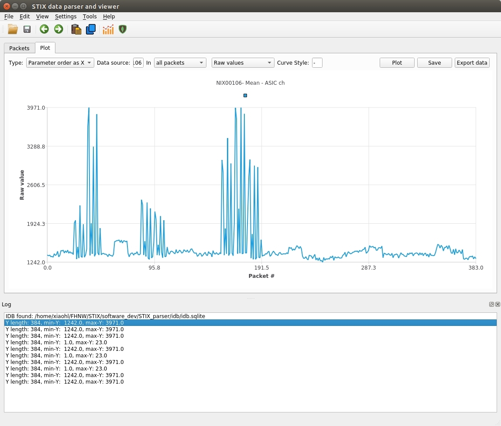

## STIX raw data parser and data viewer

A package to parser STIX ground unit raw data and to view the data. It also allows doing some simple analysis. 
Parsing of raw data is based on IDB.  

### Environment Setup

#### On Linux 
1. Install python 3
  ```
    sudo  apt-get install python3
  ```
2. Install pip
  ```
    sudo apt install python3-pip
  ```
3. Install dependencies:
```
pip3 install numpy xmltodict PyQt5 pyqtchart scipy pymongo
```


### How to use 
1. Command line parser
```
python3 applications/parser.py -i <RAW_DATA_FILENAME> -o <OUTPUT>  -v  <Verbose level>
```

2. Using the parser in your own code.  Here are several examples

Example 1

Parsing a raw data file and writting packets to a python pickle file. 

```
#!/usr/bin/python3 
from core import stix_logger
from core import stix_parser
stix_logger._stix_logger.set_logger(logfile='test.log', verbose=2)
parser = stix_parser.StixTCTMParser()
parser.parse_file('raw.binary', 'output.pkl')
```
Example 2

Parse a raw data file and print the packets. 

```
#!/usr/bin/python3 
from core import stix_parser

f=open('raw.binary','rb')
buffer=f.read()

parser = stix_parser.StixTCTMParser()
packets=parser.parse(buffer)
for packet in packets:
  print(packet['header'])
  print(packet['parameters'])
```

Example 3:
```

#!/usr/bin/python3 
import pprint
from core import stix_parser
parser = stix_parser.StixTCTMParser()
hex='0d e5 c3 ce 00 1a 10 03 19 0e 80 00 87 46 6e 97 04 80 00 87 46 00 00 00 00 00 00 00 00 00 00 00 00'
packets=parser.parse_hex(hex)

pprint.pprint(packets)

```
Output
```
[{'header': {'APID': 1509,
            'APID_packet_category': 5,
            'APID_process_ID': 94,
            'DESCR': 'STIX HK report - SID 4',
            'PUS': 16,
            'SPID': 54103,
            'SSID': 4,
            'TMTC': 'TM',
            'TPSD': -1,
            'coarse_time': 2147518278,
            'destination': 14,
            'fine_time': 28311,
            'header_flag': 1,
            'length': 17,
            'packet_id': 3557,
            'packet_type': 0,
            'process_id': 222,
            'seg_flag': 3,
            'segmentation': 'stand-alone packet',
            'seq_count': 974,
            'service_subtype': 25,
            'service_type': 3,
            'time': 2147518278.4319916,
            'version': 0},
 'parameters': [{'desc': 'SID', 'name': 'NIX00020', 'raw': (4,), 'value': ''},
                {'desc': 'Heartbeat value',
                 'name': 'NIX00059',
                 'raw': (2147518278,),
                 'value': ''},
                {'desc': 'Flare location',
                 'name': 'NIXD0059',
                 'raw': (0,),
                 'value': 'NotAvailable'},
                {'desc': 'Non-thermal flare index',
                 'name': 'NIXD0060',
                 'raw': (0,),
                 'value': 'NoSignNThrFlux'},
                {'desc': 'Thermal flare index',
                 'name': 'NIXD0061',
                 'raw': (0,),
                 'value': 'NoFlareDetect'},
                {'desc': 'Flare - global',
                 'name': 'NIXG0020',
                 'raw': (0,),
                 'value': ''},
                {'desc': 'Flare Location Z',
                 'name': 'NIX00283',
                 'raw': (0,),
                 'value': ''},
                {'desc': 'Flare Location Y',
                 'name': 'NIX00284',
                 'raw': (0,),
                 'value': ''},
                {'desc': 'Flare Duration',
                 'name': 'NIX00063',
                 'raw': (0,),
                 'value': ''},
                {'desc': 'Attenuator motion flag',
                 'name': 'NIXD0064',
                 'raw': (0,),
                 'value': 'False'},
                {'desc': 'HK global 15',
                 'name': 'NIXG0064',
                 'raw': (0,),
                 'value': ''}}
               ]
```
 
  

3. using the graphical user interface 
````
chmod +x run_gui.sh
./run_gui.sh
````
or 
````
python3 UI/parser_gui.py
````
The GUI supports the following data formats:
- STIX raw data
- SOC XML format
- MOC ascii format
- packets in  pkl, pklz,  Nosql database Mongodb

### Screenshots



